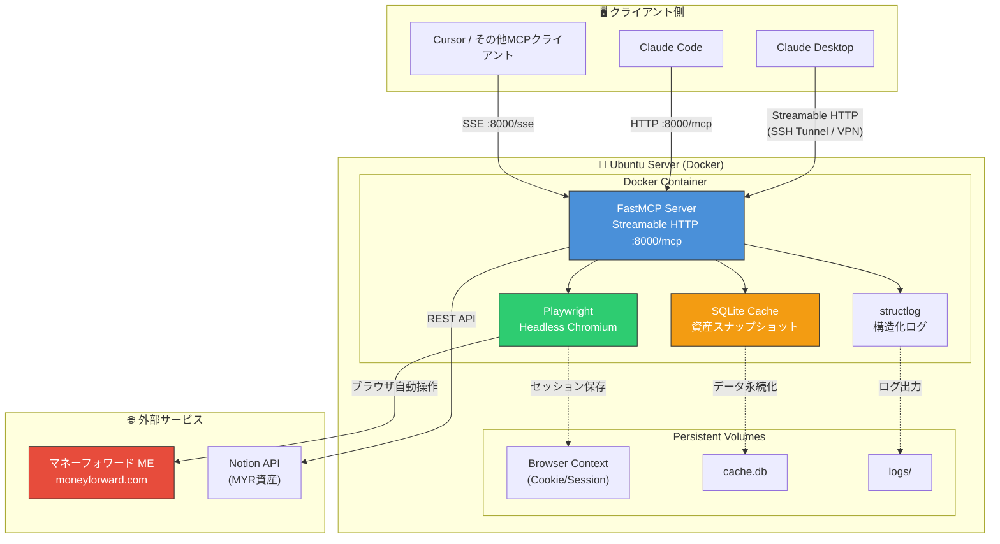
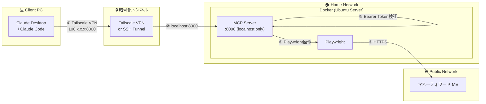

# PRP: MoneyForward ME Custom MCP Server

> **Version:** 2.0 — Ubuntu Server Edition  
> **Author:** utanutan5  
> **Last Updated:** 2025-02-01  
> **Status:** Planning Phase

---

## 1. プロジェクト概要

マネーフォワード ME（個人版）の資産・入出金データを、AIエージェント（Claude Desktop / Claude Code / Cursor等）から自然言語で参照・操作可能にする **個人専用MCPサーバー** を構築する。

公式APIが存在しないため、Playwrightによるヘッドレスブラウザ自動操作でデータを取得し、FastMCPでMCPプロトコルに変換して公開する。実行環境は **自宅Ubuntuサーバー（Docker）** を前提とする。

---

## 2. 目的と価値

| 目的 | 具体的な価値 |
|------|-------------|
| 自然言語による家計分析 | 「今月の食費の推移は？」「あといくら使える？」をAIに即座に答えさせる |
| 複数プラットフォーム統合 | マネフォのJPY資産 + Notionで管理中のMYR資産をAI上で統合分析 |
| 手動更新の自動化 | AIに「一括更新して」と命じるだけで最新データ取得 |
| 資産推移のトラッキング | 取得データをキャッシュし、日次・週次・月次の資産推移を自動記録 |

---

## 3. 技術的実現可能性調査（Ubuntu Server）

### 3.1 結論：✅ 実現可能

以下の技術要素について調査を行い、すべてUbuntuサーバー上での動作が確認済み。

### 3.2 各技術要素の検証結果

#### Playwright on Ubuntu Server

| 項目                 | 結果            | 補足                                                                |
| ------------------ | ------------- | ----------------------------------------------------------------- |
| ヘッドレスChromium      | ✅ 動作確認済       | X11ディスプレイサーバー不要。`headless=True`がデフォルト                             |
| 公式Dockerイメージ       | ✅ 提供あり        | `mcr.microsoft.com/playwright/python:v1.58.0-noble`（Ubuntu 24.04） |
| Persistent Context | ✅ サポート済       | `launch_persistent_context()`でCookie/セッションをディスクに保存                |
| メモリ使用量             | ⚠️ 約200〜500MB | Chromium 1インスタンスあたり。サーバーのRAMに余裕が必要                                |
| 初回2FA認証            | ⚠️ 対策必要       | 初回のみXvfb + VNCまたはSSH X11転送で操作。以降はセッション再利用                         |

> **技術解説：Persistent Context とは？**  
> Playwrightの `launch_persistent_context()` は、ブラウザの状態（Cookie、localStorage、sessionStorage）を指定ディレクトリに永続化する機能。通常の `launch()` は毎回クリーンな状態で起動するが、Persistent Contextを使うとログイン済みセッションを維持できる。Docker環境ではこのディレクトリをボリュームマウントする必要がある。

#### FastMCP リモート接続

| 項目 | 結果 | 補足 |
|------|------|------|
| HTTP Transport | ✅ 推奨 | 新しいStreamable HTTP方式。双方向通信対応 |
| SSE Transport | ✅ 後方互換 | 従来方式。今後非推奨化の可能性あり |
| Claude Desktop接続 | ✅ 可能 | Pro/Max/Team/Enterprise: Settings > Connectors から直接接続。Free: `mcp-remote` プロキシ経由 |
| Claude Code接続 | ✅ 可能 | `claude mcp add` でHTTPエンドポイントを登録 |

> **技術解説：MCP Transport の選択**  
> - **STDIO**: クライアントとサーバーが同一マシン上にある場合のみ。パイプ（stdin/stdout）で通信  
> - **SSE（Server-Sent Events）**: HTTP上の一方向ストリーミング。サーバー→クライアントのみ  
> - **Streamable HTTP（推奨）**: 単一HTTPエンドポイント（`/mcp`）で双方向通信。必要に応じてSSEにアップグレード  
> リモートサーバーでは **Streamable HTTP** を第一選択とし、クライアント互換性のためにSSEもフォールバックとして残す構成が最善。

#### Docker環境

| 項目 | 結果 | 補足 |
|------|------|------|
| 公式ベースイメージ | ✅ あり | `mcr.microsoft.com/playwright/python:v1.58.0-noble` |
| セキュリティ | ⚠️ 設定必要 | `--cap-add=SYS_ADMIN` またはカスタムseccompプロファイル |
| ボリューム永続化 | ✅ 可能 | ブラウザコンテキスト、キャッシュDB、ログをマウント |

### 3.3 先行事例

マネーフォワード ME のPlaywright/Seleniumスクレイピングは複数の成功事例が確認されている。GitHub Actions（Ubuntu Runner）上での定期実行や、GCP Cloud Functions上でのPuppeteer利用例もあり、サーバーサイドでの自動化は実績のあるアプローチ。

---

## 4. 技術スタック

| 構成要素 | 選定技術 | バージョン | 選定理由 |
|----------|----------|-----------|----------|
| 言語 | Python | 3.12+ | FastMCPエコシステムとの親和性 |
| MCP Framework | FastMCP | 2.x（安定版） | Pythonic API。`@mcp.tool`デコレータで迅速なツール定義 |
| Browser Automation | Playwright (Python) | 1.58+ | ヘッドレス対応、Persistent Context、公式Docker対応 |
| パッケージ管理 | uv | 最新 | 高速な依存解決、プロジェクト初期化が簡潔 |
| キャッシュDB | SQLite | 3.x | 軽量・ゼロ設定。JSON型カラムで構造化データ保存 |
| 実行環境 | Docker / Docker Compose | — | 再現性・ポータビリティの確保 |
| ホスト | Ubuntu Server 24.04 LTS | — | 自宅サーバー（既存インフラ活用） |
| 認証管理 | TOTP (pyotp) + Persistent Context | — | 2FA自動化 + セッション永続化の二段構え |
| ログ | structlog | — | 構造化ログでデバッグ・監視を効率化 |

> **技術解説：なぜ FastMCP 2.x（安定版）か？**  
> FastMCP 3.0は2025年2月現在ベータ版。Transforms、Providersなどの高度な機能が追加されているが、プロダクション用途には `pip install 'fastmcp<3'` で2.x系にピン留めが推奨されている。本プロジェクトのツール数（5〜10個程度）であれば2.xで十分。

---

## 5. アーキテクチャ



### 接続パターン

| クライアント | トランスポート | 接続方式 |
|-------------|---------------|---------|
| Claude Desktop（Pro/Max） | Streamable HTTP | Settings > Connectors から直接登録 |
| Claude Desktop（Free） | STDIO（プロキシ経由） | `mcp-remote` でローカルSTDIO→リモートHTTP変換 |
| Claude Code | HTTP | `claude mcp add --transport http` |
| Cursor / VS Code | SSE | `.cursor/mcp.json` でSSEエンドポイント指定 |

> **技術解説：`mcp-remote` プロキシパターン**  
> Claude Desktop無料版はリモートMCPサーバーへの直接接続をサポートしていない。`npx mcp-remote http://your-server:8000/mcp` を使うと、ローカルのSTDIOプロセスとして振る舞いつつ、内部でリモートHTTPサーバーにリクエストを転送してくれる。SSHトンネルと組み合わせればセキュアに使える。

---

## 6. 機能要件（Functional Requirements）

### F-1: 認証・セッション管理

| ID | 要件 | 優先度 |
|----|------|--------|
| F-1.1 | Playwright Persistent Contextを使い、Cookie/セッションをディスク永続化 | 必須 |
| F-1.2 | セッション失効を自動検知し、再ログインを試行 | 必須 |
| F-1.3 | 2FA対応：TOTP（pyotp）による認証コード自動生成 | 必須 |
| F-1.4 | ログイン失敗時のリトライ（最大3回、exponential backoff） | 必須 |
| F-1.5 | 認証情報（Email/Password/TOTP Secret）は `.env` + Docker Secrets管理 | 必須 |

> **技術解説：TOTP自動化の仕組み**  
> マネフォの2段階認証でTOTP（Google Authenticator等）を使用している場合、設定時に表示される20桁の英字（Base32シークレットキー）を控えておく。`pyotp.TOTP(secret).now()` で現在のワンタイムパスワードを生成し、Playwrightで認証コード入力欄に自動入力できる。これにより完全自動化が可能。

### F-2: MCPツール定義

```
┌──────────────────────────────────────────────────────────┐
│                    MCP Tools 一覧                         │
├──────────┬──────────────────────────┬────────────────────┤
│ ツール名  │ 説明                      │ 戻り値              │
├──────────┼──────────────────────────┼────────────────────┤
│ Phase 1（MVP）                                            │
├──────────┼──────────────────────────┼────────────────────┤
│ get_total_assets        │ 総資産額と前日比         │ JSON              │
│ list_recent_transactions│ 直近N件の入出金履歴      │ JSON Array        │
│ trigger_refresh         │ 連携口座の一括更新       │ 成功/失敗ステータス│
│ get_budget_status       │ 今月の予算消化状況       │ JSON              │
│ health_check            │ セッション生存確認       │ Boolean + 詳細    │
├──────────┼──────────────────────────┼────────────────────┤
│ Phase 2（拡張）                                           │
├──────────┼──────────────────────────┼────────────────────┤
│ get_monthly_summary     │ 指定月の収支サマリー     │ JSON              │
│ get_category_breakdown  │ カテゴリ別支出内訳       │ JSON Array        │
│ get_asset_history       │ 資産推移（キャッシュ参照）│ JSON Array + 期間 │
│ get_myr_assets          │ Notion連携MYR資産取得    │ JSON              │
│ get_combined_net_worth  │ JPY+MYR統合純資産額      │ JSON（為替込み）  │
└──────────┴──────────────────────────┴────────────────────┘
```

### F-3: ツール実装例（擬似コード）

```python
from fastmcp import FastMCP
from playwright.async_api import async_playwright
import structlog

mcp = FastMCP("MoneyForward MCP Server")
logger = structlog.get_logger()

@mcp.tool
async def get_total_assets() -> dict:
    """現在の総資産額と前日比を取得する。
    マネーフォワードMEのホーム画面から最新の資産情報をスクレイピングする。
    """
    logger.info("tool_called", tool="get_total_assets")
    async with get_browser_context() as context:
        page = await context.new_page()
        await page.goto("https://moneyforward.com/bs/portfolio")
        await page.wait_for_load_state("networkidle")
        
        total = await page.text_content(".total-assets-selector")
        diff = await page.text_content(".daily-diff-selector")
        
        result = {
            "total_assets_jpy": parse_currency(total),
            "daily_change_jpy": parse_currency(diff),
            "fetched_at": datetime.now().isoformat()
        }
        
        # キャッシュに保存（日次スナップショット）
        await save_snapshot(result)
        return result
```

### F-4: データ出力形式

すべてのツールは以下の統一フォーマットで応答する：

```json
{
  "status": "success",
  "data": { ... },
  "metadata": {
    "fetched_at": "2025-02-01T10:30:00+08:00",
    "source": "scraping",
    "cached": false,
    "cache_ttl_seconds": 300
  }
}
```

---

## 7. 非機能要件（Non-Functional Requirements）

### 7.1 セキュリティ

| 要件 | 対策 |
|------|------|
| ネットワーク露出の最小化 | MCPサーバーは `127.0.0.1` にバインド。外部アクセスはSSHトンネル/Tailscale VPN経由のみ |
| 認証情報の保護 | `.env` ファイル + Docker Secrets。Gitリポジトリには `.env.example` のみコミット |
| ブラウザコンテキストの保護 | Docker Volume のパーミッションを `700` に設定 |
| 通信の暗号化 | SSHトンネルまたはTailscale（WireGuard）により全通信を暗号化 |
| MCPサーバー認証 | Bearer Token認証をFastMCPに実装（不正なMCPクライアント接続を防止） |

> **技術解説：Tailscale vs SSHトンネル**  
> - **SSHトンネル**: `ssh -L 8000:localhost:8000 user@server` でポートフォワード。追加ソフト不要だが、接続ごとにトンネルを張る手間がある  
> - **Tailscale**: WireGuardベースのメッシュVPN。サーバーとクライアントにインストールするだけで、プライベートIPでシームレスに通信可能。`100.x.x.x:8000` でMCPサーバーに直接アクセスでき、常時接続が必要な用途にはこちらが推奨

### 7.2 堅牢性

| 要件 | 対策 |
|------|------|
| UI変更への耐性 | CSSセレクタは最小限に。`data-testid`優先、なければ構造ベースセレクタ |
| セッション管理 | 5分間隔のヘルスチェック。失効検知→自動再認証 |
| スクレイピング失敗 | リトライ3回（exponential backoff: 5s → 15s → 45s） |
| キャッシュ戦略 | TTL 5分のキャッシュ。スクレイピング失敗時は最終キャッシュを返却 |
| エラーレスポンス | MCP標準のエラーフォーマットで返却。人間が読めるメッセージ付き |

> **技術解説：セレクタ戦略の優先順位**  
> マネフォのようなSPA（Single Page Application）はUIリニューアルでDOM構造が変わりやすい。セレクタの選定優先度は：  
> 1. `data-testid` / `data-*` 属性（最も安定。テスト用に開発者が設置するため変更されにくい）  
> 2. `role` 属性 + `aria-label`（アクセシビリティ属性は比較的安定）  
> 3. セマンティックHTML要素の組み合わせ（`table > tbody > tr:nth-child(n)`）  
> 4. CSSクラス名（最も不安定。ビルドごとにハッシュ化される可能性あり）

### 7.3 パフォーマンス

| 要件 | 目標 |
|------|------|
| ブラウザ起動時間 | コンテナ起動時にChromiumを常駐。ツール呼び出し時は新規ページのみ |
| ツール応答時間 | キャッシュヒット: < 100ms / スクレイピング: < 10s |
| メモリ使用量 | Chromium常駐で 300〜500MB。サーバーは最低2GB RAM推奨 |
| 同時リクエスト | シングルブラウザインスタンス。リクエストはキューイングで直列処理 |

---

## 8. インフラ構成

### 8.1 Docker Compose 構成

```yaml
# docker-compose.yml
version: "3.8"
services:
  mf-mcp:
    build:
      context: .
      dockerfile: Dockerfile
    container_name: moneyforward-mcp
    restart: unless-stopped
    ports:
      - "127.0.0.1:8000:8000"   # localhost のみ。外部公開しない
    volumes:
      - browser-data:/app/browser-context    # セッション永続化
      - cache-data:/app/data                 # SQLiteキャッシュ
      - log-data:/app/logs                   # ログ
    env_file:
      - .env
    cap_add:
      - SYS_ADMIN        # Chromiumサンドボックスに必要
    security_opt:
      - seccomp=unconfined  # Playwright推奨設定
    healthcheck:
      test: ["CMD", "curl", "-f", "http://localhost:8000/health"]
      interval: 60s
      timeout: 10s
      retries: 3

volumes:
  browser-data:
  cache-data:
  log-data:
```

### 8.2 Dockerfile

```dockerfile
FROM mcr.microsoft.com/playwright/python:v1.58.0-noble

WORKDIR /app

# uv をインストール
COPY --from=ghcr.io/astral-sh/uv:latest /uv /usr/local/bin/uv

# 依存関係をインストール
COPY pyproject.toml uv.lock ./
RUN uv sync --frozen

# アプリケーションコードをコピー
COPY src/ ./src/

# 非rootユーザーに切り替え（セキュリティ）
RUN useradd -m mfuser && chown -R mfuser:mfuser /app
USER mfuser

EXPOSE 8000

CMD ["uv", "run", "fastmcp", "run", "src/server.py", "--transport", "http", "--host", "0.0.0.0", "--port", "8000"]
```

### 8.3 環境変数（`.env.example`）

```env
# === マネーフォワード認証 ===
MF_EMAIL=your-email@example.com
MF_PASSWORD=your-password-here
MF_TOTP_SECRET=ABCDEFGHIJKLMNOPQRST   # 2FA シークレットキー（20桁英字）

# === MCPサーバー設定 ===
MCP_TRANSPORT=http
MCP_HOST=0.0.0.0
MCP_PORT=8000
MCP_AUTH_TOKEN=your-bearer-token-here   # MCPクライアント認証用

# === キャッシュ設定 ===
CACHE_TTL_SECONDS=300                   # 5分
SNAPSHOT_INTERVAL_HOURS=24              # 日次スナップショット

# === ログ設定 ===
LOG_LEVEL=INFO
LOG_FORMAT=json
```

---

## 9. セキュリティ設計



### 脅威モデルと対策

| 脅威 | リスク | 対策 |
|------|--------|------|
| 認証情報漏洩 | 高 | `.env` は `600` パーミッション、Git管理外。本番はDocker Secrets |
| MCP不正接続 | 中 | Bearer Token認証 + VPN内のみアクセス可 |
| セッションハイジャック | 中 | Browser Contextのボリュームパーミッション `700` |
| マネフォからのBANリスク | 低〜中 | リクエスト頻度を抑制（最短5分間隔）。User-Agent設定 |
| UI変更によるスクレイピング破壊 | 中 | セレクタの外部設定化 + アラート通知 |

---

## 10. 開発ロードマップ

### Phase 0: 環境構築（Day 1〜2）

```
□ uv でプロジェクト初期化（pyproject.toml作成）
□ Docker Compose + Dockerfile 作成
□ .env.example 作成、.gitignore 設定
□ structlog 初期設定
□ CI用のpre-commitフック設定（ruff, mypy）
```

### Phase 1: 認証プロトタイプ（Day 3〜5）

```
□ Playwright Persistent Context でマネフォにログイン
□ TOTP自動入力の実装
□ セッション失効検知 + 自動再認証
□ ヘルスチェックエンドポイント実装
```

### Phase 2: データ取得 + MCP化（Day 6〜10）

```
□ get_total_assets 実装（スクレイピング + パース）
□ list_recent_transactions 実装
□ trigger_refresh 実装
□ get_budget_status 実装
□ health_check ツール実装
□ FastMCP でラップし、HTTP transport で公開
□ Claude Desktop / Claude Code からの接続テスト
```

### Phase 3: 堅牢化（Day 11〜15）

```
□ SQLiteキャッシュ層の実装（TTL付き）
□ 日次資産スナップショット（cronジョブ）
□ エラーハンドリング・リトライロジック
□ セレクタの外部設定ファイル化（selectors.yaml）
□ Bearer Token認証の実装
□ Tailscale VPN設定
```

### Phase 4: マレーシア拡張（Day 16〜20）

```
□ Notion API連携（MYR資産取得）
□ get_myr_assets / get_combined_net_worth 実装
□ 為替レートAPI連携（ExchangeRate-API等）
□ 統合ダッシュボード用のリソース定義
```

### Phase 5: 運用・監視（Day 21〜）

```
□ ログ監視（スクレイピング失敗アラート→LINE/Discord通知）
□ get_asset_history（キャッシュベース推移グラフデータ）
□ セレクタ変更の自動検知
□ ドキュメント整備（README、運用手順書）
```

---

## 11. リスク評価と緩和策

| # | リスク | 影響度 | 発生確率 | 緩和策 |
|---|--------|--------|----------|--------|
| R1 | マネフォのUI変更でスクレイピング破壊 | 高 | 高（年数回） | セレクタを外部YAML管理。失敗時は最終キャッシュを返却 + アラート |
| R2 | 2FA方式の変更 | 高 | 低 | TOTP以外（SMS等）への対応はPhase 3以降で検討 |
| R3 | アカウントBAN | 高 | 低 | リクエスト頻度制限（5分以上）。ヒューマンライクな操作間隔 |
| R4 | Docker環境の依存関係破壊 | 中 | 中 | Playwright Dockerイメージのバージョンをピン留め |
| R5 | セッション突然切れ（深夜等） | 中 | 中 | cronによる定期ヘルスチェック + 自動復旧 |
| R6 | マレーシアからのアクセスによるCAPTCHA | 中 | 低〜中 | 日本のVPN/プロキシ経由。またはCAPTCHA解決サービス検討 |

---

## 12. プロジェクト構成

```
moneyforward-mcp/
├── docker-compose.yml
├── Dockerfile
├── .env.example
├── .gitignore
├── pyproject.toml
├── uv.lock
├── README.md
├── src/
│   ├── server.py            # FastMCP サーバー定義（エントリポイント）
│   ├── config.py            # 設定管理（Pydantic Settings）
│   ├── browser/
│   │   ├── __init__.py
│   │   ├── context.py       # Persistent Context 管理
│   │   ├── auth.py          # ログイン・2FA処理
│   │   └── scraper.py       # ページスクレイピングロジック
│   ├── tools/
│   │   ├── __init__.py
│   │   ├── assets.py        # get_total_assets, get_asset_history
│   │   ├── transactions.py  # list_recent_transactions
│   │   ├── budget.py        # get_budget_status
│   │   ├── refresh.py       # trigger_refresh
│   │   └── malaysia.py      # get_myr_assets, get_combined_net_worth
│   ├── cache/
│   │   ├── __init__.py
│   │   └── sqlite_cache.py  # SQLiteキャッシュ + スナップショット
│   └── selectors.yaml       # CSSセレクタ定義（外部管理）
├── tests/
│   ├── test_auth.py
│   ├── test_tools.py
│   └── test_cache.py
└── docs/
    ├── setup-guide.md
    └── operation-guide.md
```

---

## 13. 成功基準

| 基準 | 定義 |
|------|------|
| MVP完了 | Claude Desktopから「今月の総資産は？」と聞いて正しい金額が返る |
| 安定稼働 | 1週間連続でスクレイピングエラーなく動作 |
| 統合完了 | JPY + MYR の統合純資産額がAIから取得可能 |
| 自動化完了 | 日次資産スナップショットが自動取得・蓄積されている |

---

## 付録A: Claude Desktop 接続設定例

### Pro/Max ユーザー（直接接続）

Settings > Connectors > Add MCP Server で以下を登録：
- URL: `http://100.x.x.x:8000/mcp`（Tailscale IP）

### Free ユーザー（mcp-remote プロキシ）

```json
{
  "mcpServers": {
    "moneyforward": {
      "command": "npx",
      "args": [
        "-y",
        "mcp-remote",
        "http://localhost:8000/mcp"
      ]
    }
  }
}
```

事前に `ssh -L 8000:localhost:8000 user@your-server` でトンネルを張っておく。

### Claude Code

```bash
claude mcp add moneyforward \
  --transport http \
  http://100.x.x.x:8000/mcp
```

---

## 付録B: 利用規約に関する留意事項

マネーフォワード ME の利用規約では、スクレイピングについて明示的な記述がない場合がある。本プロジェクトは **個人利用の範囲内** で、自身のアカウントデータへのアクセスのみを行う。以下の点に留意する：

- アクセス頻度は常識的な範囲（5分以上の間隔）に制限する
- 他ユーザーのデータには一切アクセスしない
- 商用利用・データ再販は行わない
- サービス側からアクセス制限を受けた場合は即座に停止する
